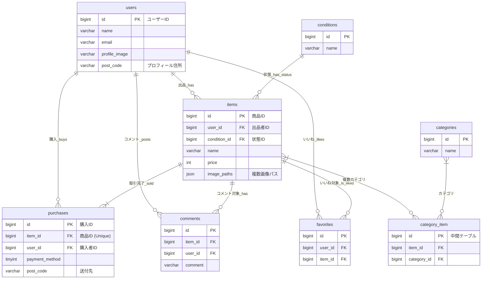

# coachtech-fleamarket

## アプリケーション概要
- Laravel 8 を使用したフリーマーケットアプリケーションです。
- Dockerで開発環境を構築可能。

---

## 環境構築手順

1. **リポジトリをクローン**
```bash
git clone git@github.com:saito-himeka/coachtech-fleamarket.git
cd coachtech-fleamarket
```

2. **Dockerコンテナを起動**
```bash
docker-compose up -d --build
```

3. **PHPコンテナに入る**
```bash
docker-compose exec php bash
```

4. **依存パッケージをインストール**
```bash
composer install
```

5. **環境設定ファイルを作成**
```bash
cp .env.example .env
php artisan key:generate
```

6. **ストレージ・キャッシュの権限設定**
```bash
chmod -R 777 storage bootstrap/cache
```

7. **データベースをマイグレーション**
```bash
php artisan migrate
```

## 使用技術/バージョン
- laravel 8.83.29
- php 8.1.33
- nginx 1.21.1
- mysql 8.0.26


## URL
- 開発環境:http://localhost
- ユーザー登録:http://localhost/register
- phpMyAdmin:http://localhost:8080
    - ユーザー名:laravel_user
    - パスワード:laravel_pass

## ER図


##ユースケース図

```mermaid
usecaseDiagram
    %% アクターの定義
    actor Guest as "ゲストユーザー"
    actor Registered as "一般ユーザー"

    %% システム境界の定義
    rect "フリマアプリ (coachtechフリマ)" {
        
        %% 閲覧系 (Public)
        usecase UC101 as "商品一覧を閲覧・検索する (US004)"
        usecase UC102 as "商品詳細を確認する (US005)"
        
        %% 認証系 (Authentication)
        usecase UC201 as "会員登録する (US001)"
        usecase UC202 as "ログインする (US002)"
        usecase UC203 as "ログアウトする (US003)"
        
        %% 交流系 (Interaction)
        usecase UC301 as "商品にいいね/解除する (US005)"
        usecase UC302 as "商品にコメントを投稿する (US005)"
        
        %% 出品・取引系 (Transaction)
        usecase UC401 as "商品を出品する (US009)"
        usecase UC402 as "商品を購入する (US006)"
        usecase UC403 as "支払い方法を設定・変更する (US006)"
        usecase UC404 as "配送先住所を変更する (US006)"
        
        %% プロフィール系 (MyPage)
        usecase UC501 as "プロフィールを確認・編集する (US007, US008)"
        usecase UC502 as "購入/出品履歴を閲覧する (US007)"
    }

    %% アクター間のリレーション: 一般ユーザーはゲストユーザーの機能を継承
    Registered --|> Guest

    %% ゲストユーザーの機能
    Guest --> UC101
    Guest --> UC102
    Guest --> UC201
    Guest --> UC202

    %% 一般ユーザーの機能
    Registered --> UC203
    Registered --> UC301
    Registered --> UC302
    Registered --> UC401
    Registered --> UC402
    Registered --> UC403
    Registered --> UC404
    Registered --> UC501
    Registered --> UC502
