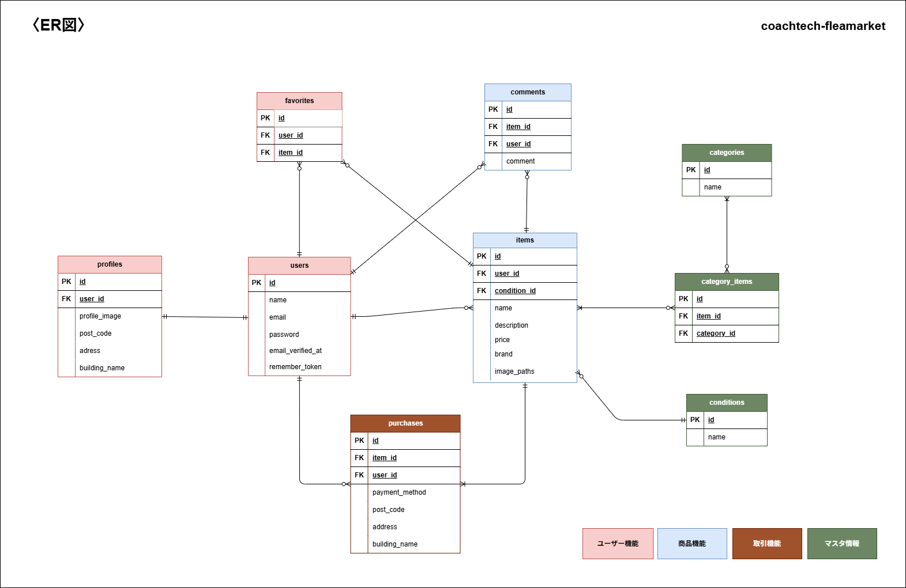

# coachtech-fleamarket

## アプリケーション概要
- Laravel 8 を使用したフリーマーケットアプリケーションです。
- Dockerで開発環境を構築可能。
```text
- 会員登録・ログイン機能（メール認証付き）
- 商品一覧表示機能（おすすめ・マイリスト切り替え）
- 商品検索機能
- 商品詳細表示機能
- 商品出品機能（画像アップロード含む）
- プロフィール編集機能
- 配送先変更機能
- Stripeによる決済機能
- いいね・コメント機能
```

---

## 環境構築手順

1. **リポジトリをクローン**
```bash
git clone git@github.com:saito-himeka/coachtech-fleamarket.git
cd coachtech-fleamarket
```

2. **Dockerコンテナを起動**
```bash
docker-compose up -d --build
```

3. **PHPコンテナに入る**
```bash
docker-compose exec php bash
```

4. **依存パッケージをインストール**
```bash
composer install
```

5. **環境設定ファイルを作成**
```bash
cp .env.example .env
php artisan key:generate
php artisan storage:link
```

6. **ストレージ・キャッシュの権限設定**
```bash
chmod -R 777 storage bootstrap/cache
```

7. **データベースをマイグレーション**
```bash
php artisan migrate
```

## テスト
テストコード（Feature Test）を実装しています。
```bash
php artisan test
```

## 使用技術/バージョン
- **Backend**: Laravel 8.83.29 (PHP 8.1.33)
- **Frontend**: Blade, CSS, JavaScript
- **Database**: MySQL 8.0.26
- **Infrastructure**: Docker, Nginx 1.21.1
- **External API**: Stripe (決済処理)

## メール認証の設定 (Mailtrap)
ローカルでのメール送信テストには Mailtrap を使用しています。
`.env` ファイルの以下の項目に、ご自身の Mailtrap 認証情報を設定してください。

```text
MAIL_MAILER=smtp
MAIL_HOST=sandbox.smtp.mailtrap.io
MAIL_PORT=2525
MAIL_USERNAME=（ユーザー名）
MAIL_PASSWORD=（パスワード）
MAIL_ENCRYPTION=tls
MAIL_FROM_ADDRESS="hello@example.com"
```

## 決済機能の設定 (Stripe)
決済機能を利用するには Stripe のアカウントが必要です。
[Stripeダッシュボード](https://dashboard.stripe.com/)から取得したAPIキーを `.env` に設定してください。

```text
STRIPE_PUBLIC_KEY=pk_test_...
STRIPE_SECRET=sk_test_...
```

## URL
- 開発環境:http://localhost
- ユーザー登録:http://localhost/register
- phpMyAdmin:http://localhost:8080
    - ユーザー名:laravel_user
    - パスワード:laravel_pass

## ER図



