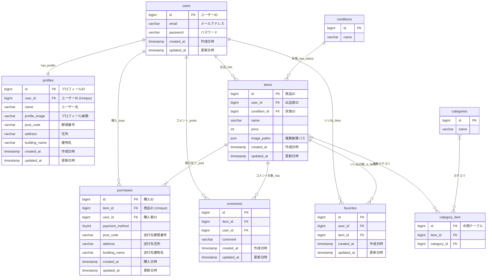

# coachtech-fleamarket

## アプリケーション概要
- Laravel 8 を使用したフリーマーケットアプリケーションです。
- Dockerで開発環境を構築可能。

---

## 環境構築手順

1. **リポジトリをクローン**
```bash
git clone git@github.com:saito-himeka/coachtech-fleamarket.git
cd coachtech-fleamarket
```

2. **Dockerコンテナを起動**
```bash
docker-compose up -d --build
```

3. **PHPコンテナに入る**
```bash
docker-compose exec php bash
```

4. **依存パッケージをインストール**
```bash
composer install
```

5. **環境設定ファイルを作成**
```bash
cp .env.example .env
php artisan key:generate
```

6. **ストレージ・キャッシュの権限設定**
```bash
chmod -R 777 storage bootstrap/cache
```

7. **データベースをマイグレーション**
```bash
php artisan migrate
```

## 使用技術/バージョン
- laravel 8.83.29
- php 8.1.33
- nginx 1.21.1
- mysql 8.0.26


## URL
- 開発環境:http://localhost
- ユーザー登録:http://localhost/register
- phpMyAdmin:http://localhost:8080
    - ユーザー名:laravel_user
    - パスワード:laravel_pass

## ER図


